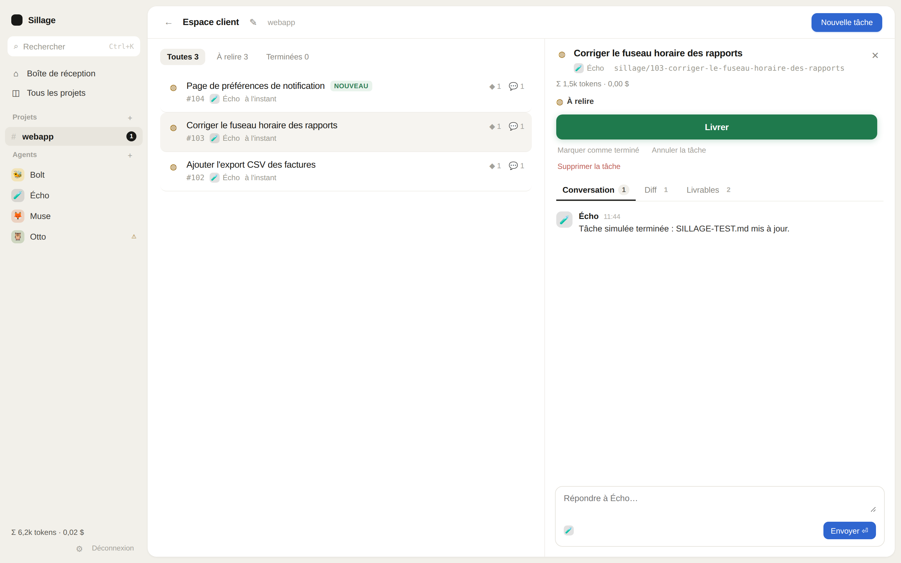
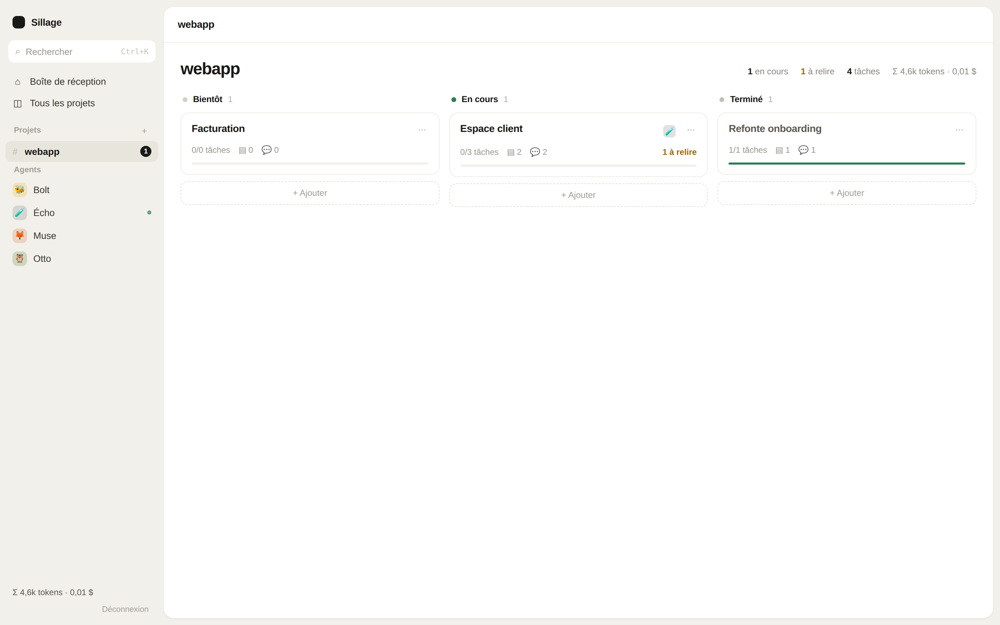

# Sillage

**A calm web dashboard to pilot AI coding agents (Claude Code, Codex CLI) across your projects.**

Sillage runs your agents in isolated git worktrees, streams their activity live, tracks every token they spend, and never lets anything leave your machine without your explicit approval. One binary, one browser tab, zero juggling between terminal windows.

*[Version française du README](README.fr.md)*



## Why

Working with several AI agents quickly turns into tab hell: five terminals, three repos, "wait, which task was I reviewing?". Sillage is built around one idea: **reduce mental load**. Each project is a kanban; each card is a small goal; each task is one agent working on one branch. You review, you approve, you ship. The wake (sillage, in French) of your work stays visible: branches, diffs, deliverables.

## Features

- **Kanban per project** (Soon / Doing / Done), cards with live agent activity, progress and unread counters.
- **Tasks like pull requests**: status icons (running, to review, ready, shipped), live activity line, file and message counters, filter pills. Lists inform, the detail panel acts.
- **One primary action per state**: interrupt, accept, ship, reopen. No button soup.
- **Conversation with the agent** (markdown, code blocks), **colored diff**, **deliverables** (commits, docs, images) in tabs.
- **Human validation is structural, not cosmetic**: agents work in a dedicated git worktree on a `sillage/<ref>-...` branch and are never allowed to push. `git push` exists in exactly one place in the code, triggered only by the ship button after an explicit confirmation.
- **Token accounting everywhere**: input/output/cost per task, aggregated per project and globally, updated live.
- **Live updates** over SSE: agent activity, messages, tokens, without reloading.
- **Mobile friendly**: responsive layout with a drawer sidebar, works great over Tailscale from your phone.
- **Built-in free agent** (Écho 🧪): a simulated agent to try the whole workflow without spending a token.
- **English and French UI**, switchable from the sidebar, auto-detected from your browser.
- **Agents managed from the UI**: create and edit agents (name, emoji, CLI, model, context prompt).
- **Simple multi-user**: shared workspace, username and password accounts, an admin manages users from the UI.
- **Open a PR** on GitHub for a shipped task (`gh pr create`, with the same explicit confirmation as shipping).



## Quickstart

Requirements: Go 1.24+, git, and at least one agent CLI ([Claude Code](https://docs.anthropic.com/en/docs/claude-code) and/or [Codex CLI](https://github.com/openai/codex)), logged in.

```bash
go install github.com/Halleck45/sillage@latest
sillage
```

Or from source: `go build -o sillage . && ./sillage`

Then open http://127.0.0.1:8787 and log in as `admin`. On first start, a password is generated and printed once in the terminal. To choose your own: `SILLAGE_PASSWORD=yourpassword sillage`. Additional users can be created from the settings icon in the sidebar (admin only).

Add a project (any local git repository), create a card, create a task, pick an agent: it starts working immediately in its own worktree. Try the free agent Écho first if you want to see the flow without any API cost.

## Security model

- Agents run headless with a fixed allowlist of tools: file edits and read-only commands inside the task worktree. Never `git push`, never permission bypass flags.
- The server binds to `127.0.0.1` by default. Password login (bcrypt), HttpOnly session cookies, login rate limiting, JSON content-type enforcement on mutations.
- **Never expose the HTTP port directly to the internet.** For remote access use [Tailscale](https://tailscale.com) (`sillage -addr <tailscale-ip>:8787`) or a TLS reverse proxy; the session cookie switches to Secure automatically behind `X-Forwarded-Proto: https`.
- Data lives in `~/.local/share/sillage` (JSON state, atomic writes) plus one git worktree per task.

Note for codex agents: Sillage runs them with `--sandbox workspace-write`. On machines where AppArmor blocks bubblewrap (`bwrap: Operation not permitted`), either allow unprivileged user namespaces (`sudo sysctl kernel.apparmor_restrict_unprivileged_userns=0`) or start Sillage with `SILLAGE_CODEX_SANDBOX=danger-full-access`, knowing that the remaining containment is Sillage's own (dedicated worktree, no push, human validation).

## Agents

Four agents are seeded on first run and stored in the state file (editable there for now, UI coming):

| Agent | CLI | Role |
|---|---|---|
| Bolt 🐝 | claude (sonnet) | pragmatic backend developer |
| Muse 🦊 | claude (opus) | product, specs, documentation |
| Otto 🦉 | codex | infrastructure, CI, tooling |
| Écho 🧪 | built-in fake | free local agent for demos and tests |

Each agent has a context prompt appended to its system prompt, and a model. Conversations resume the underlying CLI session, so follow-up messages keep full context.

## Architecture

Single Go binary, embedded vanilla JS frontend (no framework, no build step), JSON file persistence, SSE for realtime. The HTTP/JSON/SSE contract is documented in [docs/SPEC-API.md](docs/SPEC-API.md) and the internals in [docs/SPEC-BACKEND.md](docs/SPEC-BACKEND.md).

```
main.go               server bootstrap, flags, embedded web/
internal/server/      store (JSON), auth, SSE hub, git worktrees, agent runners, handlers
web/                  index.html, style.css, app.js
```

## Roadmap

- Per-user unread state and per-project permissions.
- Project deletion and archiving.
- More agent CLI adapters.
- More languages for the UI.

Contributions welcome: see [CONTRIBUTING.md](CONTRIBUTING.md).

## License

[MIT](LICENSE)
